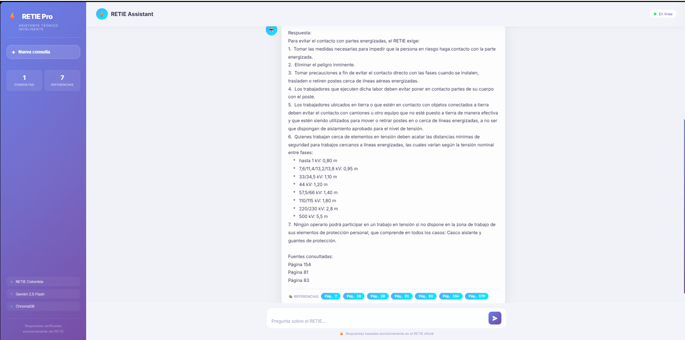
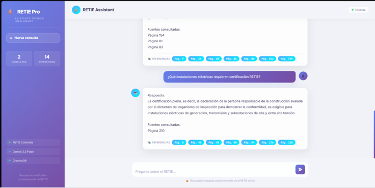
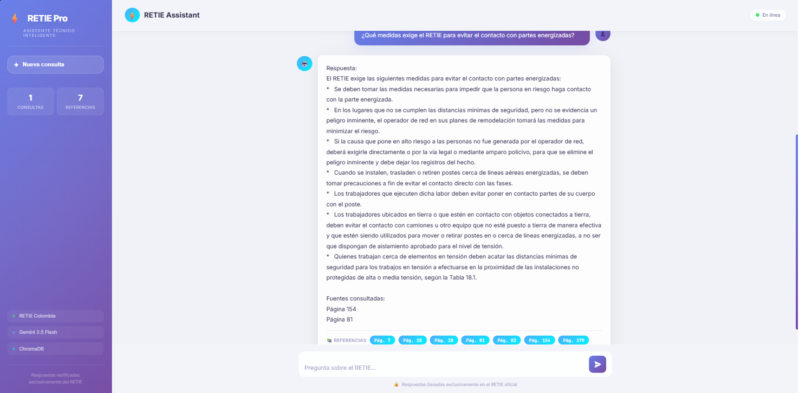
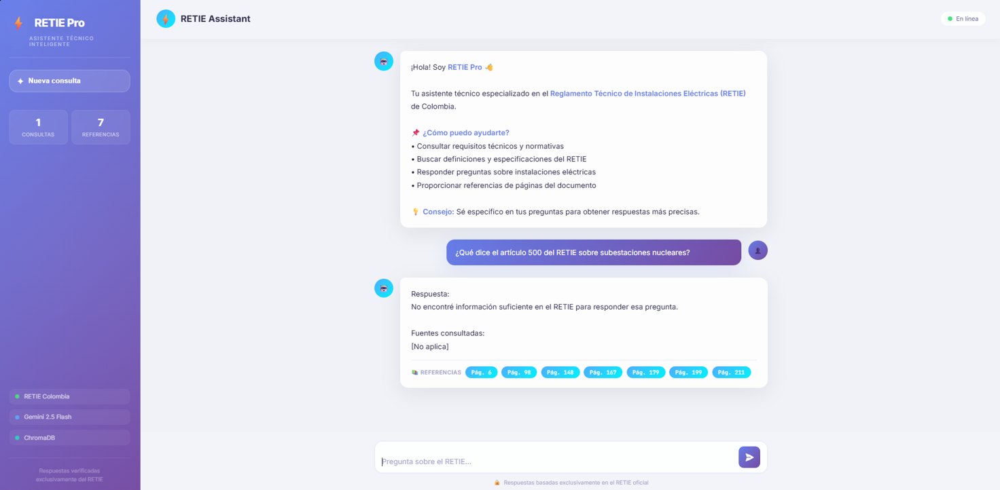
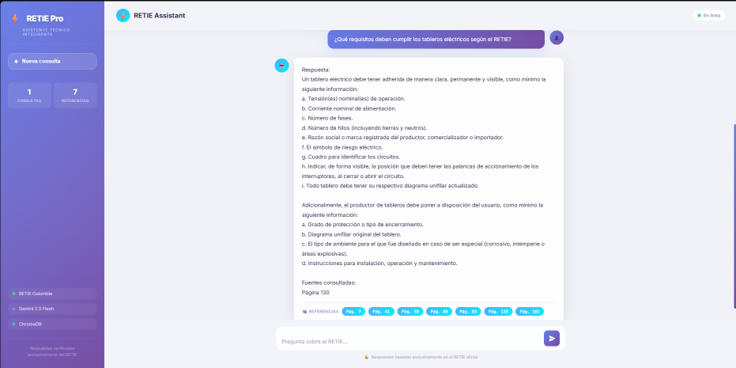

# ⚡ RETIE Pro — Asistente Técnicoelect RETIE

**Estudiante:** Fabian Andrés Rincón Rincón
**Fecha:** 21 de junio de 2026

---

# 1. Documento seleccionado y justificación

## Documento seleccionado

Reglamento Técnico de Instalaciones Eléctricas (RETIE) de Colombia.

## Justificación

Se seleccionó el RETIE debido a que es la normativa principal que regula las instalaciones eléctricas en Colombia. Es un documento extenso y técnico que suele ser complejo de consultar manualmente.

Mediante un sistema RAG (Retrieval-Augmented Generation) es posible realizar consultas en lenguaje natural y obtener respuestas fundamentadas directamente en el reglamento, facilitando la búsqueda de información para estudiantes, técnicos e ingenieros del sector eléctrico.

---

# 2. Persona usuaria objetivo y caso de uso

## Usuario objetivo

* Técnicos electricistas.
* Ingenieros electricistas.
* Estudiantes de ingeniería eléctrica.
* Inspectores y profesionales del sector energético.

## Caso de uso

Un usuario necesita consultar rápidamente requisitos del RETIE sin revisar manualmente cientos de páginas del documento.

El asistente permite formular preguntas en lenguaje natural y devuelve respuestas basadas únicamente en el contenido del RETIE, indicando las páginas utilizadas como fuente.

---

# 3. Arquitectura del sistema

| Capa           | Tecnología                           |
| -------------- | ------------------------------------ |
| LLM            | Gemini 2.5 Flash                     |
| Embeddings     | all-MiniLM-L6-v2                     |
| Base Vectorial | ChromaDB                             |
| Backend        | Flask                                |
| Frontend       | HTML, CSS y JavaScript               |
| Técnica        | Retrieval-Augmented Generation (RAG) |

## Flujo RAG

Pregunta del usuario

↓

Embedding de la pregunta

↓

Búsqueda semántica en ChromaDB

↓

Recuperación de fragmentos relevantes del RETIE

↓

Construcción del prompt con contexto

↓

Gemini 2.5 Flash genera la respuesta

↓

Respuesta + páginas consultadas

---

# 4. Preguntas de prueba y respuestas obtenidas

## Pregunta 1

¿Qué medidas exige el RETIE para evitar el contacto con partes energizadas?

**Respuesta obtenida:**

Para evitar el contacto con partes energizadas, el RETIE exige:

1. Tomar las medidas necesarias para impedir que la persona en riesgo haga contacto con la parte energizada.
2. Eliminar el peligro inminente.
3. Tomar precauciones a fin de evitar el contacto directo con las fases cuando se instalen, trasladen o retiren postes cerca de líneas aéreas energizadas.
4. Los trabajadores que ejecuten dicha labor deben evitar poner en contacto partes de su cuerpo con el poste.
5. Los trabajadores ubicados en tierra o que estén en contacto con objetos conectados a tierra deben evitar el contacto con camiones u otro equipo que no esté puesto a tierra de manera efectiva.
6. Respetar las distancias mínimas de seguridad establecidas por el RETIE.
       * hasta 1 kV: 0,80 m
       * 7,6/11,4/13,2/13,8 kV: 0,95 m
       * 33/34,5 kV: 1,10 m
       * 44 kV: 1,20 m
       * 57,5/66 kV: 1,40 m
       * 110/115 kV: 1,80 m
       * 220/230 kV: 2,8 m
       * 500 kV: 5,5 m

7. Ningún operario podrá participar en un trabajo en tensión si no dispone en la zona de trabajo de sus elementos de protección personal, que comprende en todos los casos: Casco aislante y guantes de protección.

**Fuentes:** Páginas 154, 81 y 83.

### Espacio para evidencia



---

## Pregunta 2

¿Qué instalaciones eléctricas requieren certificación RETIE?

**Respuesta obtenida:**

La certificación plena, es decir, la declaración de la persona responsable de la construcción avalada por el dictamen del organismo de inspección para demostrar la conformidad es exigible para instalaciones eléctricas de generación, transmisión y subestaciones de alta y extra alta tensión.

**Fuente:** Página 210.

### Espacio para evidencia



---

## Pregunta 3

¿Qué medidas exige el RETIE para evitar el contacto con partes energizadas?

**Respuesta obtenida:**

El RETIE exige las siguientes medidas para evitar el contacto con partes energizadas:
* Se deben tomar las medidas necesarias para impedir que la persona en riesgo haga contacto con la parte energizada.
* En los lugares que no se cumplen las distancias mínimas de seguridad, pero no se evidencia un peligro inminente, el operador de red en sus planes de remodelación tomará las medidas para minimizar el riesgo.
* Si la causa que pone en alto riesgo a las personas no fue generada por el operador de red, deberá exigirle directamente o por la vía legal o mediante amparo policivo, para que se elimine el peligro inminente y debe dejar los registros del hecho.
* Cuando se instalen, trasladen o retiren postes cerca de líneas aéreas energizadas, se deben tomar precauciones a fin de evitar el contacto directo con las fases.
* Los trabajadores que ejecuten dicha labor deben evitar poner en contacto partes de su cuerpo con el poste.
* Los trabajadores ubicados en tierra o que estén en contacto con objetos conectados a tierra, deben evitar el contacto con camiones u otro equipo que no esté puesto a tierra de manera efectiva y que estén siendo utilizados para mover o retirar postes en o cerca de líneas energizadas, a no ser que dispongan de aislamiento aprobado para el nivel de tensión.
* Quienes trabajan cerca de elementos en tensión deben acatar las distancias mínimas de seguridad para los trabajos en tensión a efectuarse en la proximidad de las instalaciones no protegidas de alta o media tensión, según la Tabla 18.1.


**Fuentes:** Páginas 154 y 81.

### Espacio para evidencia



---

## Pregunta 4 - Verificación a respuesta de pregunta fuera de contexto 

¿Qué dice el artículo 500 del RETIE sobre subestaciones nucleares?

**Respuesta obtenida:**

No encontré información suficiente en el RETIE para responder esa pregunta.

**Fuentes:** No aplica.

### Espacio para evidencia



---

## Pregunta 5

¿Qué requisitos deben cumplir los tableros eléctricos según el RETIE?

**Respuesta obtenida:**

Un tablero eléctrico debe tener adherida de manera clara, permanente y visible, como mínimo la siguiente información:
1. Tensión(es) nominal(es) de operación.
2. Corriente nominal de alimentación.
3. Número de fases.
4. Número de hilos (incluyendo tierras y neutros).
5. Razón social o marca registrada del productor, comercializador o importador.
6. El símbolo de riesgo eléctrico.
7. Cuadro para identificar los circuitos.
8. Indicar, de forma visible, la posición que deben tener las palancas de accionamiento de los interruptores, al cerrar o abrir el circuito.
9. Todo tablero debe tener su respectivo diagrama unifilar actualizado.

Adicionalmente, el productor de tableros debe poner a disposición del usuario, como mínimo la siguiente información:
1. Grado de protección o tipo de encerramiento.
2. Diagrama unifilar original del tablero.
3. El tipo de ambiente para el que fue diseñado en caso de ser especial (corrosivo, intemperie o áreas explosivas).
4. Instrucciones para instalación, operación y mantenimiento.


**Fuente:** Página 130

### Espacio para evidencia



---

# 5. Instrucciones de ejecución

## Requisitos

* Python 3.12
* API Key de Google AI Studio
* PDF del RETIE denominado RETIE.pdf

## Instalación

Crear entorno virtual:

```bash
python -m venv .venv
```

Activar entorno virtual:

```bash
.venv\Scripts\activate
```

Instalar dependencias:

```bash
pip install -r requirements.txt
```

Configurar archivo .env:

```env
GOOGLE_API_KEY=TU_API_KEY
```

Copiar el documento:

```text
RETIE.pdf
```

Generar índice vectorial:

```bash
python indexar_retie.py
```

Ejecutar la aplicación:

```bash
python app.py
```

Abrir en navegador:

```text
http://localhost:5000
```

---


# 6. Conclusiones

Durante el desarrollo del proyecto se aprendió el funcionamiento de la arquitectura RAG para consultar documentos extensos mediante lenguaje natural.

La principal limitación identificada es que la calidad de la respuesta depende de los fragmentos recuperados por el motor de búsqueda semántica. Si la información relevante no es recuperada correctamente, la respuesta puede ser incompleta aunque exista dentro del documento.
